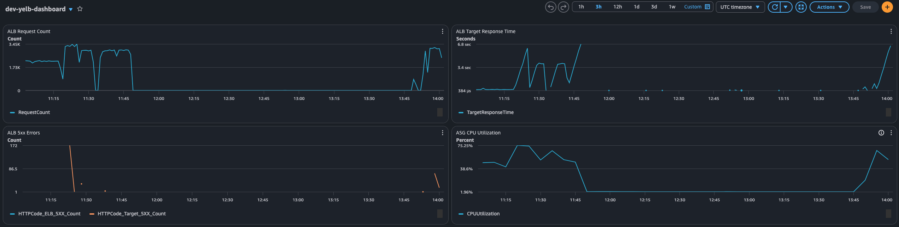
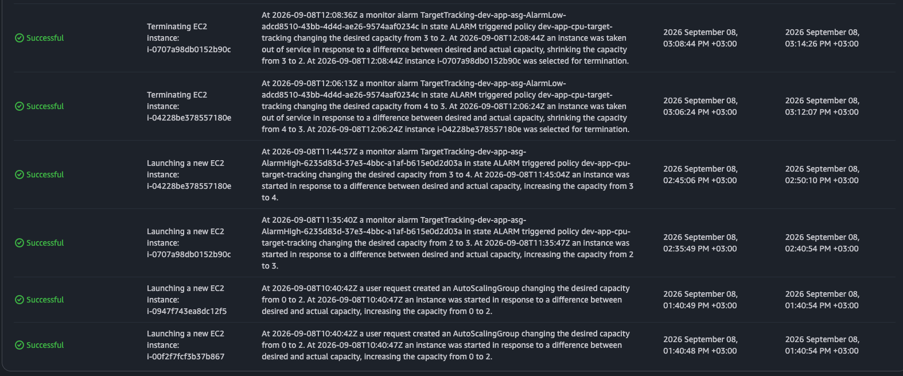

# Phase 5 — Load Testing & EC2 Autoscaling Proof

## Setup

- **Load generator:** Locust running as a Docker container (`locustio/locust:latest`) on a dedicated `t3.micro` EC2 instance in the public subnet, provisioned via Terraform (`modules/locust`)
- **Target:** yelb ALB (`http://dev-app-alb-1639575232.us-east-1.elb.amazonaws.com`)
- **Load profile:** weighted 20:1:1:1:1 — mostly `GET /api/getvotes`, occasional votes across the four restaurants
- **Wait time:** `constant(0)` — no think time between requests, maximum pressure per virtual user
- **ASG config:** min 2 / desired 2 / max 4, `t2.micro` instances
- **Scaling policy:** target tracking on `ASGAverageCPUUtilization`, target value 50%

## Results

### Peak load metrics
| Metric | Value |
|---|---|
| Peak ALB request count | ~3.45K per period |
| Peak ASG CPU utilization | ~75% |
| ALB target response time (baseline) | 384 µs |
| ALB target response time (under load) | up to 6.8 sec |
| ALB 5xx errors (peak) | 172 |

### Scale-out events
| Time (UTC) | Action | Capacity | Instance |
|---|---|---|---|
| 11:35:40 | AlarmHigh triggered | 2 → 3 | `i-0707a98db0152b90c` |
| 11:44:57 | AlarmHigh triggered | 3 → 4 | `i-04228be378557180e` |

### Scale-in events
| Time (UTC) | Action | Capacity | Instance |
|---|---|---|---|
| 12:06:13 | AlarmLow triggered | 4 → 3 | `i-04228be378557180e` |
| 12:08:36 | AlarmLow triggered | 3 → 2 | `i-0707a98db0152b90c` |

## Evidence

